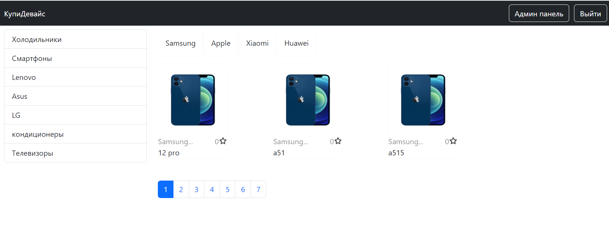
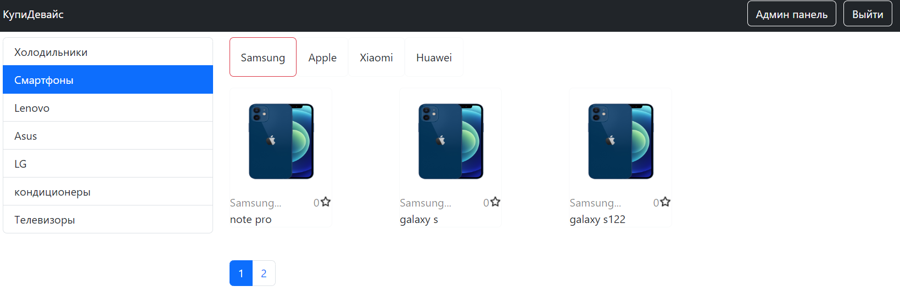
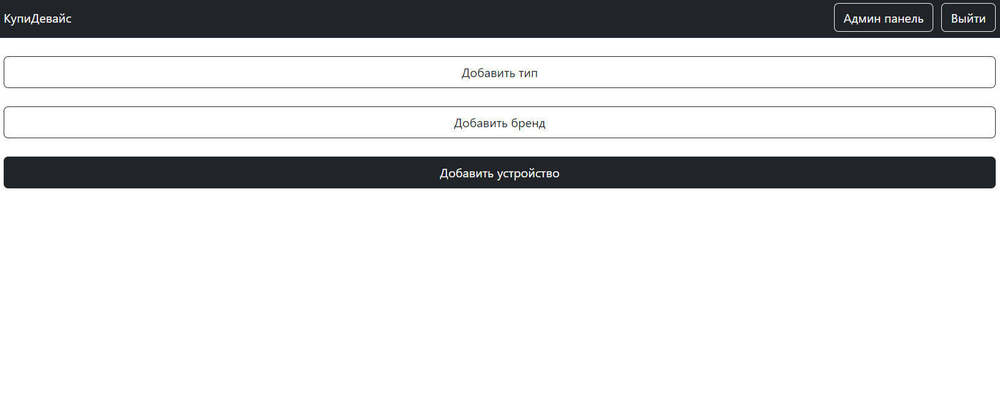
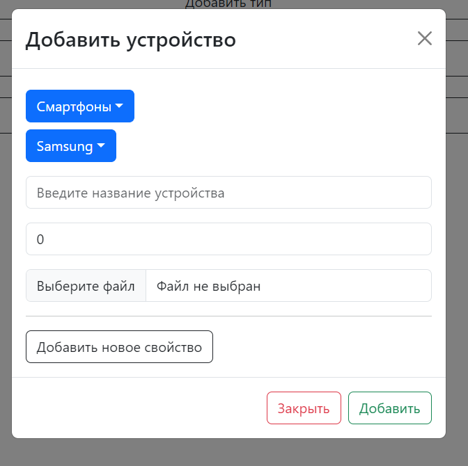
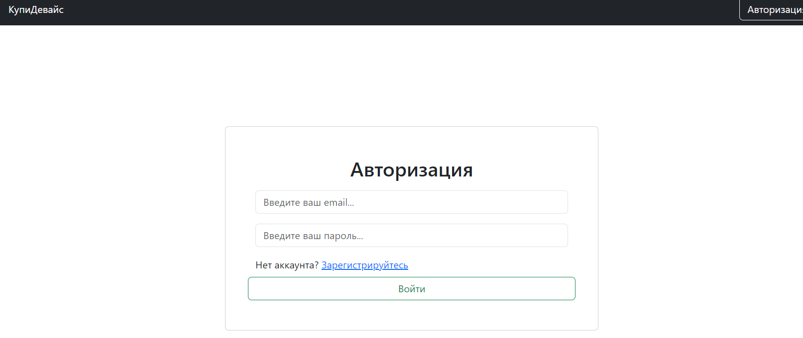

# Getting Started with Create React App

This project was bootstrapped with [Create React App](https://github.com/facebook/create-react-app).

## Available Scripts client

In the project directory, you can run:

### `npm start`

## Available Scripts server

In the project directory, you can run:

### `npm run dev`

Runs the app in the development mode.\
Open [http://localhost:3000](http://localhost:3000) to view it in your browser.

The application is a full-fledged client-server architecture.
- Exchange of database data
- Logging and registration (jwt token)
- Admin panel! (adding new items to the store)
- Pagination
- Sorting products by brands, types

sql database and er-model in "db-data" folder